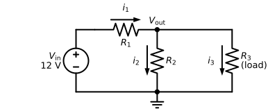
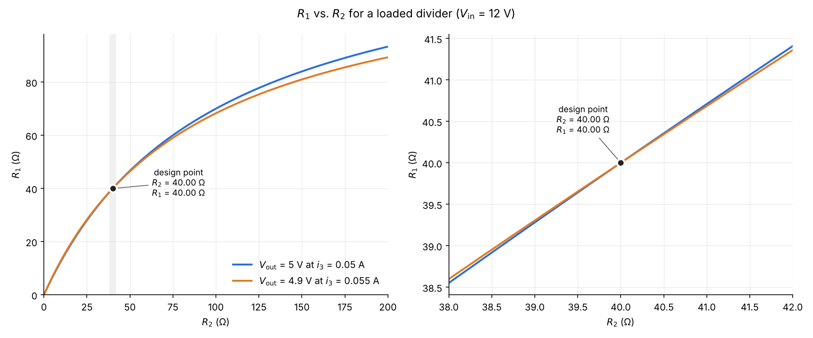

# Sizing a loaded resistive divider: 12 V → 5 V

## Circuit

As an example application, we might be charging a cell phone from a 12 V supply,
where we know the phone draws a nominal 50 mA at 5 V. Figure 1 shows a resistive
divider that does this, with the phone as the load $R_3$.

*Figure 1. Loaded voltage divider. $R_1$ and $R_2$ form the divider, and $R_3$ is the load.*

## Governing equation

In the circuit of Figure 1, a divider made of $R_1$ (top) and $R_2$ (bottom) drops a supply $V_\mathrm{in}$ to
an output $V_\mathrm{out}$. The load, $R_3$, connects from the output to ground. The
three branch currents are numbered to match their resistors:

- $i_1 = (V_\mathrm{in} - V_\mathrm{out}) / R_1$, the current through $R_1$. This is
  also the current drawn from the supply.
- $i_2 = V_\mathrm{out} / R_2$, the current through $R_2$.
- $i_3 = V_\mathrm{out} / R_3$, the load current through $R_3$.

Applying Kirchhoff's current law at the output node, $i_1 = i_2 + i_3$, gives

$$
\frac{V_\mathrm{in} - V_\mathrm{out}}{R_1} = \frac{V_\mathrm{out}}{R_2} + i_3
\quad\Longleftrightarrow\quad
R_2\,(V_\mathrm{in} - V_\mathrm{out}) = R_1\,(V_\mathrm{out} + R_2\, i_3)
$$

For fixed $V_\mathrm{in}$, $V_\mathrm{out}$ and $i_3$, every ($R_2$, $R_1$) pair on the curve

$$
R_1 = \frac{R_2\,(V_\mathrm{in} - V_\mathrm{out})}{V_\mathrm{out} + R_2\, i_3}
$$

satisfies the equation. As $R_2 \to \infty$ the curve approaches
$R_1 = (V_\mathrm{in} - V_\mathrm{out}) / i_3$.

## Design requirement

With $V_\mathrm{in} = 12$ V, the divider must:

1. deliver $V_\mathrm{out} = 5$ V at a nominal load current of $i_3 = 50$ mA, and
2. sag no lower than $V_\mathrm{out} = 4.9$ V if the load current rises by 10% to
   $i_3 = 55$ mA.

Each requirement gives its own curve of ($R_2$, $R_1$) pairs. Only one divider lies on
both, where the curves cross in Figure 2: $R_1 = R_2 = 40\ \Omega$.

*Figure 2. $R_1$ vs. $R_2$ for the two requirements. The curves cross at the 40 Ω / 40 Ω design point, which is shown in the gray area of the left panel and in the zoomed panel on the right. Both curves have an asymptote as $R_2 \to \infty$, at $R_1 = (V_\mathrm{in} - V_\mathrm{out}) / i_3$: the blue curve approaches 140 Ω and the orange curve approaches 129.1 Ω.*

## Power from the supply

At the design point, for both load conditions:

| Condition | $V_\mathrm{out}$ | $i_1$ (supply) | $i_2$ | Supply power | $P_{R_1}$ | $P_{R_2}$ | Power to load |
|---|---|---|---|---|---|---|---|
| Nominal load, 50 mA | 5.00 V | 175 mA | 125 mA | 2.10 W | 1.225 W | 0.625 W | 0.25 W |
| High load, 55 mA | 4.90 V | 177.5 mA | 122.5 mA | 2.13 W | 1.260 W | 0.600 W | 0.27 W |

The 12 V supply must provide about 2.1 W to deliver 0.25 W to the load, so the
divider is only about 12% efficient. The other ~88% is dissipated as heat in $R_1$
and $R_2$. That's the price of making the output stiff enough (about 20 Ω output
resistance, $R_1 \parallel R_2$) to hold the 4.9 V limit.

## Sizing the resistors for power

Each resistor's power rating should be chosen from its **worst-case** dissipation,
plus a safety margin of at least 50%:

- **$R_1$**: dissipation $(V_\mathrm{in} - V_\mathrm{out})^2 / R_1$ is highest when
  $V_\mathrm{out}$ is lowest, i.e. at the 55 mA load: 1.26 W × 1.5 ≈ 1.9 W, so use a
  **2 W** resistor or larger.
- **$R_2$**: dissipation $V_\mathrm{out}^2 / R_2$ is highest when $V_\mathrm{out}$ is
  highest, i.e. at the 50 mA load: 0.625 W × 1.5 ≈ 0.94 W, so use a **1 W** resistor
  or larger.

These figures assume the load stays between 50 and 55 mA. If the load can be
disconnected, $V_\mathrm{out}$ rises to 6 V and each resistor dissipates 0.9 W, so
$R_2$ needs about 1.35 W (use 2 W). If the output can be shorted, $R_1$ sees the full
12 V and dissipates 3.6 W, which calls for a resistor of at least 5.4 W or a fuse
to limit the fault.

## Comparison: series resistor only ($R_1 = 140\ \Omega$, no $R_2$)

The simplest way to get 5 V at 50 mA is to leave out $R_2$ entirely
($R_2 \to \infty$) and drop the extra 7 V across a single series resistor,
$R_1 = (12 - 5)\ \mathrm{V} / 50\ \mathrm{mA} = 140\ \Omega$. This is the point the
blue curve in Figure 2 approaches at its asymptote. With no $R_2$, all of the supply
current goes to the load ($i_1 = i_3$), and the output voltage is

$$
V_\mathrm{out} = V_\mathrm{in} - R_1\, i_3 = 12\ \mathrm{V} - (140\ \Omega)\, i_3
$$

| Load current $i_3$ | $V_\mathrm{out}$, 140 Ω only | $V_\mathrm{out}$, 40 Ω / 40 Ω divider |
|---|---|---|
| 50 mA | 5.00 V | 5.00 V |
| 55 mA | 4.30 V | 4.90 V |

When the cell phone's current rises by 10% to 55 mA, the output sags by 0.7 V (14%)
to 4.3 V, well below the 4.9 V limit. That's 7 times the 0.1 V sag of the
40 Ω / 40 Ω divider. The reason is the output resistance seen by the load: the
whole 140 Ω here, versus $R_1 \parallel R_2 = 20\ \Omega$ for the divider.

The single resistor is much more efficient. The supply provides only 0.60 W at
50 mA, so about 42% reaches the load, and $R_1$ dissipates 0.35 W (0.42 W at 55 mA).
Even if the output is shorted, $R_1$ dissipates only $12^2 / 140 \approx 1.03$ W.
The catch is that $V_\mathrm{out}$ depends entirely on the load current. At light
load it rises toward the full 12 V, which could damage a device that expects 5 V.
The divider trades efficiency for a stiffer output: $R_2$ wastes power on purpose,
so that changes in the load current make up a smaller share of the current through
$R_1$.
